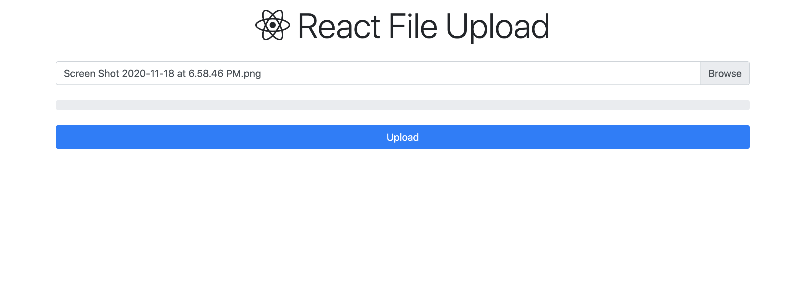
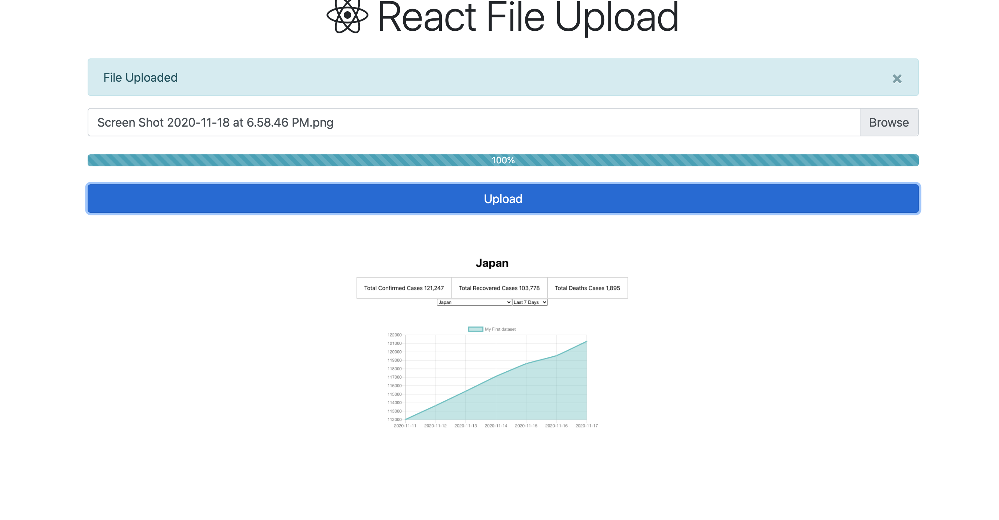

# React Image Uploader
  

## Description
A simple react application

## Table of Contents
* [Description](#Description)
* [Installation](#Installation)
* [Usage](#Usage)
* [Licensing](#License)
* [Contributions](#Contributions)
* [Testing](#Tests)

## Installation

```
npm i
```

## Usage
localhost:3000

## License
MIT

## Contributions
Traversy Media

## Images



## Questions 
You can click the following link to be taken to my GitHub profile: (http://github.com./EpicGibbon)


Feel free to reach out to me with any questions or comments: [mailto:Michant1997@gmail.com]
